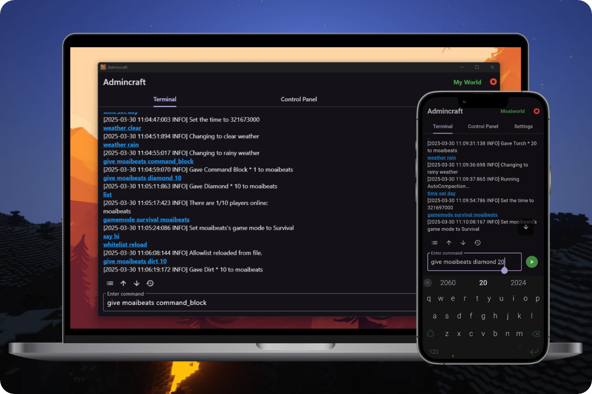

  

<h1 align="center">
  Admincraft
</h1>

  Multiplatform app to control Minecraft Bedrock Dockerized servers, built with Flutter.

  
  
  
  
    
  

  

##  What is Admincraft?

Admincraft is a multiplatform app for managing Minecraft Bedrock servers in Docker containers. Given that RCON isn't available for Bedrock, Admincraft uses the [Admincraft WebSocket](https://github.com/joanroig/admincraft-websocket) project to interact with the Minecraft server. This approach allows for secure and real-time command execution and server management through a WebSocket connection, providing an intuitive GUI for tasks such as issuing commands, performing server maintenance, and monitoring server logs.

### Current project status

- Currently optimized for use with Oracle Always Free, using a server created with [docker-minecraft-bedrock-server](https://github.com/itzg/docker-minecraft-bedrock-server/tree/master).
- Development is focused on Android and Windows; other platforms may be unstable.

##  Getting Started

You need a Minecraft Bedrock server and [Admincraft WebSocket](https://github.com/joanroig/admincraft-websocket) running in Docker to use Admincraft. Visit the [server setup guide](docs/server/SERVER_SETUP.md) to set up yours for free!

Once you have your server ready, [download Admincraft for your platform](https://github.com/joanroig/admincraft/releases), add your server in the app, and you're good to go!

##  Development

- Follow the official [Flutter installation guide](https://docs.flutter.dev/get-started/install).
- Open the project in the IDE of your choice ([VSCode](https://code.visualstudio.com/) is recommended) and run the app by following [this guide](https://docs.flutter.dev/tools/vs-code#running-and-debugging).

### Build Android APK

- Run `flutter build apk`.
- The APK will be available at [build/app/outputs/apk/release](build/app/outputs/apk/release).

### Build Windows Executable

- Run `flutter build windows`.
- The .exe file with the required files will be available at [build/windows/x64/runner/Release](build/windows/x64/runner/Release).

### Automatic Builds

Admincraft uses GitHub Actions to automate building and releasing the app. New releases are triggered by running the "Bump Version & Release" workflow from the GitHub Actions tab. This will automatically start the build and release process. The process consists of two workflows:

- **Bump Version & Release** ([.github/workflows/bump-version-and-release.yml](.github/workflows/bump-version-and-release.yml)): This workflow bumps the version in `pubspec.yaml`, commits the change, and creates a new tag. It can be triggered manually and supports major, minor, or patch version increments.
- **Build and Release** ([.github/workflows/build-and-release.yml](.github/workflows/build-and-release.yml)): This workflow is triggered manually or automatically after the completion of the "Bump Version & Release" workflow. It builds the app for Android and Windows, names the artifacts with the version, and uploads them to the [GitHub Releases page](https://github.com/joanroig/admincraft/releases) as downloadable files.

##  Feature Roadmap

You can view the planned, started, and completed features in [GitHub Projects](https://github.com/users/joanroig/projects/2/views/2).

##  Community & Contributions

The community and team are available in [GitHub Discussions](https://github.com/joanroig/admincraft/discussions), where you can ask for support, discuss the roadmap, and share ideas.

Our [Contribution Guide](https://github.com/joanroig/admincraft/blob/main/CONTRIBUTING.md) describes how to contribute to the codebase and documentation.

##  Credits

Docker tools

- [docker-minecraft-bedrock-server](https://github.com/itzg/docker-minecraft-bedrock-server)
- [Bedrockifier](https://github.com/Kaiede/Bedrockifier)
- [Admincraft WebSocket](https://github.com/joanroig/admincraft-websocket)

Fonts

- [Miracode](https://github.com/IdreesInc/Miracode)
- [Scientifica](https://github.com/oppiliappan/scientifica)
- [Monocraft](https://github.com/IdreesInc/Monocraft)

##  License

Licensed under the [GPLv3 License](https://github.com/joanroig/admincraft/blob/main/LICENSE.txt).
