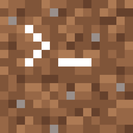
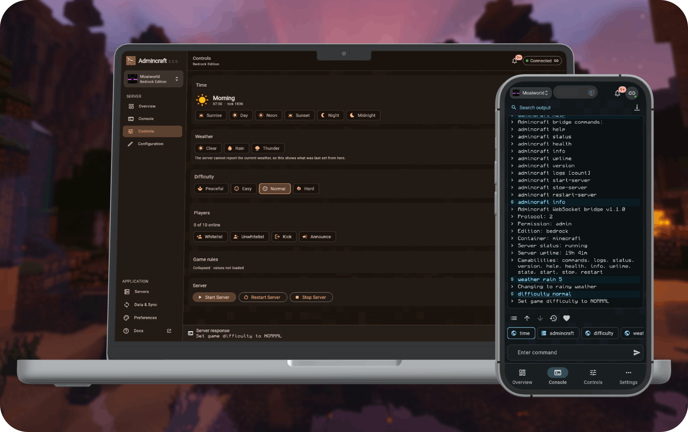

  

<h1 align="center">
  Admincraft
</h1>

  Multiplatform app to control Minecraft Bedrock and Java servers, built with Flutter.

  
  
  
  
    
  
  

  

##  What is Admincraft?

Admincraft is a multiplatform app for managing Minecraft Bedrock and Java Edition servers. The [Admincraft WebSocket](https://github.com/joanroig/admincraft-websocket) bridge uses the Bedrock Docker console or Java RCON internally, while the app keeps the same secure WebSocket connection on every platform. It provides an intuitive GUI for issuing commands, performing server maintenance, and monitoring server logs.

[Open Admincraft Web](https://joanroig.github.io/admincraft/) · [Read the documentation](https://joanroig.github.io/admincraft/docs/)

### Current project status

- Bedrock is optimized for [docker-minecraft-bedrock-server](https://github.com/itzg/docker-minecraft-bedrock-server/tree/master); Java is optimized for [docker-minecraft-server](https://github.com/itzg/docker-minecraft-server).
- Releases are available for Android, Windows, macOS, and Linux. The hosted web
  app runs from the same Flutter codebase with browser-specific networking and
  certificate restrictions.
- Runs in the browser too (`flutter run -d chrome`), with two limitations the browser imposes: self-signed certificates cannot be loaded, because the browser validates TLS itself and exposes no way to add a trust anchor, and a page served over HTTPS cannot open an unencrypted `ws://` connection, so the `Private network` option only works when the app itself is served over `http://` (such as a local build).

##  Getting Started

You need a Minecraft server and [Admincraft WebSocket](https://github.com/joanroig/admincraft-websocket). Visit the [documentation](https://joanroig.github.io/admincraft/docs/) for installation, connection, backup, and troubleshooting guides. Use the [Bedrock setup guide](docs/server/SERVER_SETUP.md) or the [Java setup guide](docs/getting-started/java-server.md).

Once you have your server ready, [download Admincraft for your platform](https://github.com/joanroig/admincraft/releases), add your server in the app, and you're good to go!

In the app settings, pick the **Connection Security** option matching your setup: `Private network` for Tailscale, a VPN or a LAN, `Public certificate` for a server with a publicly trusted certificate, and `Self-signed certificate` to load your own. The [server setup guide](docs/server/SERVER_SETUP.md#choosing-how-to-connect) walks through each one.

**Settings → Data & Sync** can copy/paste or export/import all saved server
profiles. Transfers include server secret keys, so Admincraft always encrypts
them with a passphrase you choose.

##  Development

This section is for contributors and custom-build maintainers. App users should
start with the [user documentation](https://joanroig.github.io/admincraft/docs/getting-started/install/);
server operators should use the [server setup guides](https://joanroig.github.io/admincraft/docs/getting-started/).

- Follow the official [Flutter installation guide](https://docs.flutter.dev/get-started/install).
- Open the project in the IDE of your choice ([VSCode](https://code.visualstudio.com/) is recommended) and run the app by following [this guide](https://docs.flutter.dev/tools/vs-code#running-and-debugging).

### Build Android APK

- Run `flutter build apk`.
- The APK will be available at [build/app/outputs/apk/release](build/app/outputs/apk/release).

### Build Windows Executable

- Run `flutter build windows`.
- The .exe file with the required files will be available at [build/windows/x64/runner/Release](build/windows/x64/runner/Release).

### Build Web and Documentation

- Install the documentation dependencies with `python -m pip install -r requirements-docs.txt`.
- Run `flutter build web --release --wasm --base-href /admincraft/`.
- Run `python -m mkdocs build --strict --site-dir build/web/docs`.
- The combined GitHub Pages site will be available under `build/web`, with documentation in `build/web/docs`.

Pushes to `main` automatically test, build, and deploy both through the **Deploy web app and docs** workflow. In the repository's Pages settings, the source must be set to **GitHub Actions**.

### Automatic Builds

Admincraft uses GitHub Actions to automate building and releasing the app. New releases are triggered by running the "Bump Version & Release" workflow from the GitHub Actions tab. This will automatically start the build and release process. The process consists of two workflows:

- **Bump Version & Release** ([.github/workflows/bump-version-and-release.yml](.github/workflows/bump-version-and-release.yml)): This workflow bumps the version in `pubspec.yaml`, commits the change, and creates a new tag. It can be triggered manually and supports major, minor, or patch version increments.
- **Build and Release** ([.github/workflows/build-and-release-app.yml](.github/workflows/build-and-release-app.yml)): This workflow builds the release artifacts, names them with the version, and uploads them to the [GitHub Releases page](https://github.com/joanroig/admincraft/releases).

##  Feature Roadmap

You can view the planned, started, and completed features in [GitHub Projects](https://github.com/users/joanroig/projects/2/views/2).

##  Community & Contributions

The community and team are available in [GitHub Discussions](https://github.com/joanroig/admincraft/discussions), where you can ask for support, discuss the roadmap, and share ideas.

Our [Contribution Guide](https://github.com/joanroig/admincraft/blob/main/CONTRIBUTING.md) describes how to contribute to the codebase and documentation.

##  Credits

- Item icons from [mcicons](https://github.com/themuhamed/mcicons) by @themuhamed, used under the MIT License.

Docker tools

- [docker-minecraft-bedrock-server](https://github.com/itzg/docker-minecraft-bedrock-server)
- [Bedrockifier](https://github.com/Kaiede/Bedrockifier)
- [Admincraft WebSocket](https://github.com/joanroig/admincraft-websocket)

Fonts

- [Miracode](https://github.com/IdreesInc/Miracode)
- [Scientifica](https://github.com/oppiliappan/scientifica)
- [Monocraft](https://github.com/IdreesInc/Monocraft)

##  License

Admincraft version 2.0.0 and later is source-available under the
[PolyForm Shield License 1.0.0](https://github.com/joanroig/admincraft/blob/main/LICENSE).
See [LICENSING.md](https://github.com/joanroig/admincraft/blob/main/LICENSING.md)
for the version boundary and third-party components.

##  Disclaimer

**NOT AN OFFICIAL MINECRAFT PRODUCT. NOT APPROVED BY OR ASSOCIATED WITH MOJANG OR MICROSOFT.**

Minecraft is a trademark of Mojang Synergies AB. Admincraft is an independent
project with no affiliation to Mojang, Microsoft, or the maintainers of any
server image it works with.
